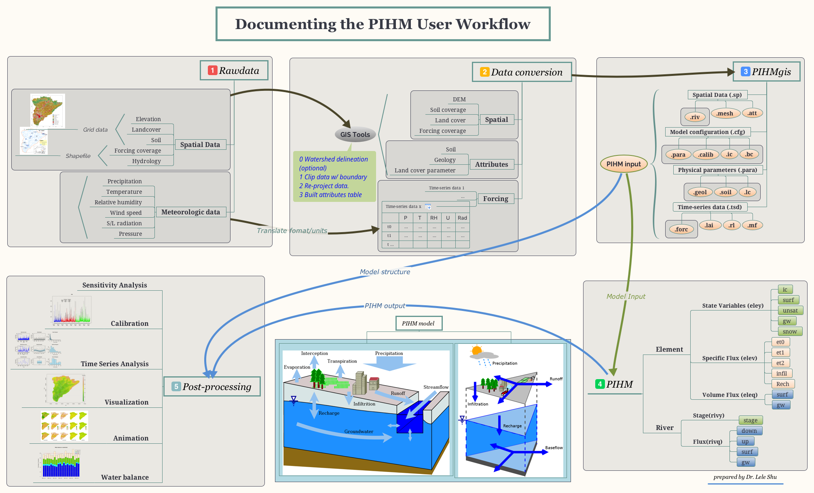

# Introduction {#intro}

**PIHM** The Penn State Integrated Hydrologic Model (PIHM) is a multiprocess, multi-scale hydrologic model where the major hydrological processes are fully coupled using the semi-discrete Finite Volume Method.

**PIHMGIS** The model itself is "tightly-coupled" with PIHMgis, an open-source Geographical Information System designed for PIHM. The PIHMgis provides the access to the digital data sets (terrain, forcing and parameters) and tools necessary to drive the model, as well as a collection of GIS-based pre- and post-processing tools.

Collectively the system is referred to as the Penn State Integrated Hydrologic Modeling System (PIHMS). 

The PIHM is an open source software, freely available for download at [PIHM website](www.pihm.psu.edu) or [Github Page](https://github.com/shulele/PIHM++) along with installation and user guides.

## Why PIHM?
It is our intention to begin a debate on the role of *Community Models* in the hydrologic sciences. Our research is a response to recent trends in US funding for *Observatory Science* that have emerged at NSF over the last few years, namely, the NSF-funded **CUAHSI** program (Consortium of Universities for Advanicing Hydrologic Sciences).

PIHM represents our strategy for the synthesis of *multi-state*, *multiscale* distributed hydrologic models using the integral representation of the underlying physical process equations and state variables. 

Our interest is in devising a concise representation of watershed and/or river basin hydrodynamics, which allows interactions among major physical processes operating simultaneously, but with the flexibility to add or eliminate states/processes/constitutive relations depending on the objective of the numerical experiment or purpose of the scientific or operational application.

To satisfy the objectives, the PIHM

- is distributed hydrologic model, based on the semi-discrete **Finite-Volume Method (FVM)** in which domain discretization is an unstructured triangular irregular network (e.g. Delaunay triangles) generated with constraints (geometric, and parametric). A local prismatic control volume is formed by vertical projection of the Delauney triangles forming each layer of the model. Given a set of constraints (e.g. river network support, watershed boundary, altitude zones, ecological regions, hydraulic properties, climate zones, etc), an “optimal” mesh is generated. River volume elements are also prismatic, with trapezoidal or rectangular cross-section, and are generated along or cross edges of Delauney triangles. The local control volume contains all equations to be solved and is referred to as the model kernel. 
- is physically-based model, in which all equations used is descibing the physics of the hydrological processes which control the catchment. The physical model is ablr to predict the water in ungage water system, to estimate the sediment, pullutants and vegetation etc, such that it is practical to be coupled with biochemistry, geomorphology, limnology and other water-related research. 
The global ODE system is assembled by combining all local ODE systems throughout the domain and then solved by a state-of-the-art parallel ODE solver known as CVODE developed at the Lawrence- Livermore National Laboratory.
- is fully-couple hydrologic model, where the state and flux variables in the hydrologic system are solved within same time step and conserve the mass. The fluxes are infiltration, overland flow, groundwater recharge, lateral groundwater flow, exchange of river and soil/groundwater and river discharge.
- is adaptable temporal and spatial resolution. The spatial resolution of model varies from meters to kilometers based requirement of modeling and computing resources. Internal time step of iteration step are adjustable; it is able to export the status of catchment in less  1 sencond to days. Also the time interval for exporting results is configured flexiblly. The flexible spatial and temporal resolution is rather valueable for community model coupling.
- is open source model, anyone can access the source code, use and submit their improvement.
- is long-term yield and single-event flood model.

An important partnership and motivation for this work was the Project Leaders participation in two community-science research activites over the last few years: The University of Arizona-led Science and Technology Center (SAHRA: Sustainability of Water Resources in Semi- Arid Regions), and the Chesapeake Community Modeling Project (CCMP). Each of these research programs has been essential to supporting the concept of **Community Models** for environmental prediction and helping to make it happen.

## History of PIHM system
- 2005 PIHM v1.0

Dr Yizhong Qu developed and verified the first version of PIHM in 2001-2005 during his PhD in Pennsylvania State Unversity, following the blueprint of Freeze and Harlan (1969). This version of PIHM is the soul of the PIHM model.

- 2009 PIHMgis 

Dr. Gopal Bhartt developed the PIHMgis with support of C++, Qt GUI library, TRIANGLE library and QGIS developing kit. The developmemnt of PIHMgis make the learning curve of PIHM moderate and benefits the developing, modeling and coupling.

- 2015 MM-PIHM

Dr. Yuninh Shi led and developed the MM-PIHM (Multi-Module PIHM), which embeded the all modules from PIHM family, such as RT-PIHM, LE-PIHM, flux-PIHM, BGC-PIHM etc. together. The sophysiticated design and coupling of the MM-PIHM is the summit of the PIHM as a *Community Model* that combined all water-related module together.

- 2019 PIHM++

  Based on the accumulated contribution of PIHM modeling and coupling with related researches, it is neccessary to 
  solve the known bugs and limitation,
  improve the performance of model with parrellel methods,  and
  adopt new update from SUNDIALS solver and programming strategy. 
## Steps of PIHM modeling

### Essential Terrestrial Variables?

- Atmospheric Forcing (precipitation, snow cover, wind, relative humidity, temperature, net radiation, albedo, photosynthestic atmospheric radiation, leaf area index)
- Digital elevation models
- River/Stream Discharge
- Soil (class, hydrologic properties)
- Groundwater (levels, extent, hydro-geologic properties)
- Lake/Reservoir (levels, extent)
- Land Cover/Use (biomass, human infrastructure, demography, ecosystem disturbance)
- Water Use

Most data reside on federal servers ....many petabytes

### A-Priori Data Sources

|Feature/Time-Series | Property | Source |
|:-----------:|:----------------:|:-------------------------------:|
|Soil| Porosity; Sand, Silt, Clay Fractions; Bulk Density | CONUS, SSURGO and STATSGO|
|Geology| Bed Rock Depth; Horizontal and Vertical Hydraulic Conductivity | http://www.dcnr.state.pa.us/topogeo/, http://www.lias.psu.edu/emsl/guides/X.html|
|Land Cover|LAI |[UMC](http://glcf.umiacs.umd.edu/data/landcover/data.shtml), [LDASmapveg](http://ldas.gsfc.nasa.gov/LDAS8th/MAPPED.VEG/LDASmapveg.shtml); |
|Land Cover|Manning’s Roughness; | Hernandez et. al., 2000 |
|River| Manning’s Roughness;| Dingman (2002) |
|River| Coefficient of Discharge | ModHms Manual (Panday and Huyakorn, 2004) |
|River| Shape and Dimensions; | Derived from regression using depth, width and discharge data from [USGS data](http://nwis.waterdata.usgs.gov/usa/nwis/measurements)|
|River| Topology: Nodes, Neighboring Elements; | Derived using PIHMgis (Bhatt et. al., 2008)|
|Forcing| Prec, Temp. RH, Wind, Rad. | National Land Data Assimilation System : NLDAS-2|
|Topography| DEM |http://seamless.usgs.gov/ |
|Streamflow| | http://nwis.waterdata.usgs.gov/nwis/sw |
|Groundwater| | http://nwis.waterdata.usgs.gov/nwis/gw |

## Steps

1. Prepare raw Essential Terrestrial Variables (ETV)
1. Build the PIHM modeling domain with [PIHMgis](http://www.pihm.psu.edu/pihmgis_home.html) or [PIHMgisR](https://github.com/shulele/PIHMgisR) (Recommended for PIHM++)
1. Run PIHM on desktop or cluster.
1. Analysis the PIHM results with [PIHMgisR](https://github.com/shulele/PIHMgisR) or your hydrologic analysis tools.

<!-- ## Overview of PIHM via a modeling in Shall Hills[^1] -->
<!-- [^1]: The example of Shall Hills is realized with latest PIHM++ -->

<!-- The Shale Hills hydrologic experiment was conducted on a 0.08 $km^2$ watershed in the Valley and Ridge physiographic province of central Pennsylvania in 1974 by the Forest Hydrology group at the Pennsylvania State University.  -->
<!-- One goal of the study was to experimentally determine the physical mechanisms of runoff and stream-flow generation at the upland forested watershed. The other goal is to evaluate the effects o f antecedent soil moisture on the runoff peak and timing. -->

<!--  The experiment consisted of a comprehensive network of 40 piezometers, 40 neutron access tubes for soil moisture and four weirs located along the single channel in the watershed. The distribution of sampling sites is shown in figure 1. The upper part of the channel is ephemeral. It flows during storms or snowmelt periods. The watershed was implemented with a spray irrigation network, shown in figure 2(a), to precisely control the amount of artificial rainfall over the entire watershed. It is applied below the tree canopy and above the surface vegetation to avoid canopy interception. Besides the grass, the hillslope is also covered by a layer of leaves and forest litter. It is known that macrospores from decayed root and worm holes underneath this layer may contribute to high hydraulic conductivity of the soil as -->
<!-- shown in figure 2(b).  -->

<!-- The soil profile at Shale Hills is typically a silt loam, ranging from 0.6 meter thickness at the ridge top, to 2.5 meters deep near the channel. Specifically, the main soil types are: Ashby soil type, the shaley-silt-loam in the upland portion of the watershed; the Blairton silt loam on the intermediate elevation slopes; and the Ernest silt loam in the lower region along the channel. -->

<!-- From July to September 1974, there were a series of 9, equal artificial rainfall events (0.25 inch/hr for 6 hours) applied to the entire watershed. The events were conducted such that the antecedent moisture gradually increased from very dry in the first storm, to very wet in the 9th. Along with the artificial rainfall, natural rainfall events also occurred which complicated the experiment. To reduce the impact of the natural events, 6 consecutive rainfall events were selected and simulated in this paper. -->

## Research with PIHM family

|Research Ara | Scientific question | Reference |
|:-----------:|:--------------------------:|:------:|
| Malpasset dam, etc. | Hydrodynamic in dam break and food event  | [@Li2011] | 
|  |   |  | 
|  |   |  | 
|  |   |  | 
|  |   |  | 
|  |   |  | 
|  |   |  | 
|  |   |  | 
|  |   |  | 

## Latest update

PIHM++ is the latest version of PIHM, re-developed in C++, a updated version from the PIHM v2.2 that is the stable and widely applied version, and that was released on 2010. 

The design of PIHM++ is going to advance the PIHM to the new level:

- Technical improvement
  1. Support the latest implicit Sundial/CVODE solver.
  2. Re-code the program in object-oriented programming method.
  3. More human readable input/output files and filenames.
  5. Support OpenMP and OpenMPI Parrallel computing.
  6. The functions to handle the time-series data, including forcing, LAI, Roughness Length, Boundary Condition, Melt factor.
  7. Speed up the model performance via coding strategies.
  8. Screen output the model status and time-spend.
  4. Fix the bugs in PIHM v2.x.
  
- Model improvement
  1. Change the structure/shape of River.
  2. Add Lakes into the hydrologic process (keep updating).
  3. CMA-ES calibration, with either OpenMP or OpenMPI.
  4. Use the Greem-Ampt method to estimate infiltration.
  5. Add the waterbalance control in elements.
  6. Hourly update the ET and Potential ET.
  7. Model debug mode.
  8. Export model initial condition at specific interval.
  9. Automatic check the range of physical parameters
  

## Governing equations

| Physical process |  Equation name | Governing equation | Semi-discrete formula from ODE|
|:-------- |:--------  |:-----------------------  |:-----------------------  |
| Interception | Bucket model | $\frac{d S_{ic}}{d t} = P - E_{ic}-P_{tf}$ | $\left(\frac{d S_{ic}}{d t}=R_{veg} * \left(P-E_{I}-P_{t}\right)\right)_{i}$ |
| Snow melt | Temperature Index Model | $\frac{d S_{sn}}{d t}=P-E_{sn}-q_{sm}$  | $\left(\frac{d S_{sn}}{d t}=P-E_{sn}-q_{sm}\right)_{i}$ |
| Overland flow | St. Venant Equation (2D)  |$\frac{\partial h}{\partial t}+\frac{\partial(u h)}{\partial x}+\frac{\partial(v h)}{\partial y}=q$ | $\left(\frac{d h}{\partial t} =P_{net}-E_{sf}-q_{inf}-q_{sf}\right)_{i}$ |
| Unsaturated zone | Richards Equation | $C(\psi) \frac{\partial \psi}{\partial t}=\nabla-K(\psi) \cdot \nabla(\psi+Z)$ | $\left(\frac{d S_{unsat}}{d t}=q_{inf}-q_{rech}-ET_{s}\right)_{i}$ |
| Groundwater flow| Richards Equation$ | $C(\psi) \frac{\partial \psi}{\partial t}=\nabla-K(\psi) \cdot  \nabla(\psi+Z)$ | $\left(S_y \frac{d S}{d t}=q_{rech}+q_{gw}\right)_{i}$ |
| River channel | St. Venant Equation (1D) | $\frac{\partial h}{\partial t}+\frac{\partial(u h)}{\partial x}=q$ | $\left(\frac{\partial S}{\partial t} = Q_{up} + Q_{surf} + Q_{sub} + Q_{down} \right)_{i}$ |
